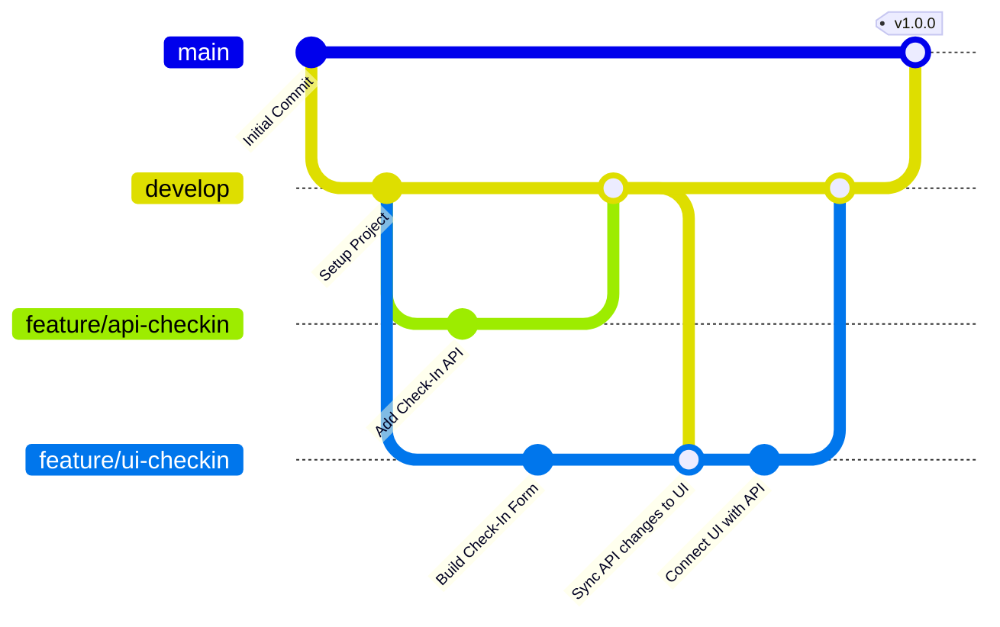

# Strategi Arsitektur Git - Pemisahan Frontend & Backend Services

Untuk memastikan pengembangan Frontend Services (Web Application) dan Backend Services (API) dapat di-maintain secara independen tanpa adanya bentrokan (code collision), kami merekomendasikan strategi arsitektur Git berikut:

## 1. Pendekatan Repositori (Monorepo dengan Branching / Multi-Repo)

Terdapat dua pendekatan utama untuk memisahkan siklus rilis dan pemeliharaan kode:

### Opsi A: Monorepo Terstruktur (Direkomendasikan untuk Inertia.js)
Karena Inertia.js berjalan secara native di dalam proyek Laravel, kode frontend dan backend berada di satu repositori. Pemisahan dilakukan secara struktural:
- **Backend (API, Database, Logic)**: Berada di `/app`, `/routes/api.php`, `/database`, `/config`.
- **Frontend (Web Application)**: Berada di `/resources/js`, `/resources/css`, `/routes/web.php`.

Untuk menghindari bentrokan antar developer:
1. **Branching Strategy (Git Flow)**:
   - `main`: Kode produksi yang stabil dan siap rilis.
   - `develop`: Integrasi utama untuk semua fitur baru.
   - `feature/api-[nama-fitur]`: Branch khusus pengembangan API backend.
   - `feature/ui-[nama-fitur]`: Branch khusus pengembangan tampilan & integrasi frontend.
2. **Strict Code Ownership**: Developer backend hanya menyentuh file API, controller API, dan migrasi. Developer frontend hanya fokus pada folder `/resources/js` dan styling.

### Opsi B: Multi-Repo (Decoupled Services)
Jika perusahaan startup ingin memisahkan sepenuhnya deployment frontend (misal di Vercel/Netlify) dan backend (misal di AWS/Heroku):
1. **Repositori Backend**: Berisi Laravel API, database migration, dan Sanctum Auth. Expose endpoint `/api/*`.
2. **Repositori Frontend**: Berisi web SPA (React/Vue) menggunakan Vite secara terpisah yang mengonsumsi REST API backend menggunakan HTTP calls + Bearer Token.

---

## 2. Alur Branching & Deployment (Git Flow)

### Langkah Kerja Developer:
1. **Developer Backend** membuat branch `feature/api-checkin` untuk menulis logika validasi check-in.
2. Setelah selesai dan dites, branch tersebut di-merge ke `develop` melalui **Pull Request (PR)**.
3. **Developer Frontend** membuat branch `feature/ui-checkin`. Mereka dapat mengambil perubahan API terbaru dari `develop` dengan melakukan `git merge develop` atau `git rebase develop`.
4. Kode diintegrasikan dan diverifikasi pada branch `develop` sebelum digabungkan ke `main` untuk rilis.

---

## 3. Aturan Git & CI/CD
1. **Pull Request (PR) Template & Reviews**: Setiap PR wajib ditinjau oleh tim terkait (Backend Lead untuk API, Frontend Lead untuk UI).
2. **Automated Testing**: CI/CD (seperti GitHub Actions) akan menjalankan:
   - Backend: PHPUnit / Pest tests (`php artisan test`).
   - Frontend: Linter & build check (`npm run build`).
3. **Conflict Prevention**: Perubahan skema database wajib dilakukan melalui Laravel Migrations, dan frontend harus selalu membaca spesifikasi API (Postman / Swagger) sebelum melakukan integrasi.
